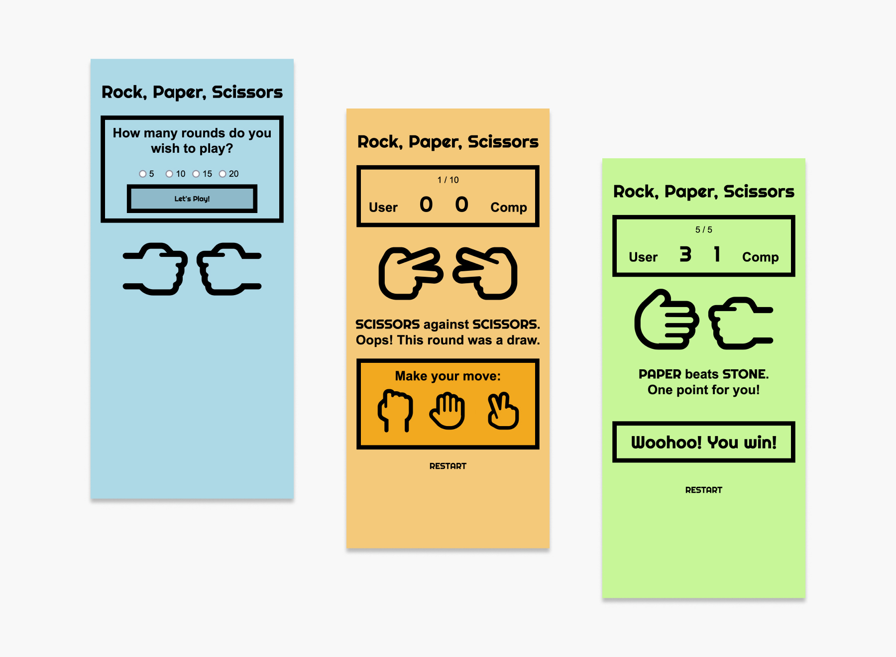

# rock-paper-scissors | Online game

This is an online game for "rock-paper-scissors". Simply chose between one of three shapes and play aigainst the computer.

## Table of contents

- [Overview](#overview)
  - [The challenge](#the-challenge)
  - [Screenshot](#screenshot)
  - [Links](#links)
- [My process](#my-process)
  - [Built with](#built-with)
  - [Continued development](#continued-development)
- [Author](#author)
- [Acknowledgments](#acknowledgments)

## Overview

### The challenge

Everyone has played "Rock, Paper, Scissors" at some point in their life. So you already know the rules.

- Define how many rounds we will play against the computer.
- The color should change when it's a win, tie, or loss.
- Feel free to get creative with the design.

### Screenshot

### Links

- Solution URL: [https://github.com/jenniferhubermayer/rock-paper-scissors](https://github.com/jenniferhubermayer/rock-paper-scissors)
- Live Site URL: [https://jenniferhubermayer.github.io/retro-calculator/](https://jenniferhubermayer.github.io/rock-paper-scissors/)

## My process

### Built with

- Semantic HTML5 markup
- SCSS
- Flex
- JavaScript

### Continued Development

- would be great to use some loops to make js shorter

## Author

- Website - [https://github.com/jenniferhubermayer](https://github.com/jenniferhubermayer)

## Acknowledgments

This project has been realized as part of the [super(c)ode](https://www.super-code.de/) "Front-End Boot-Camp 2022".
